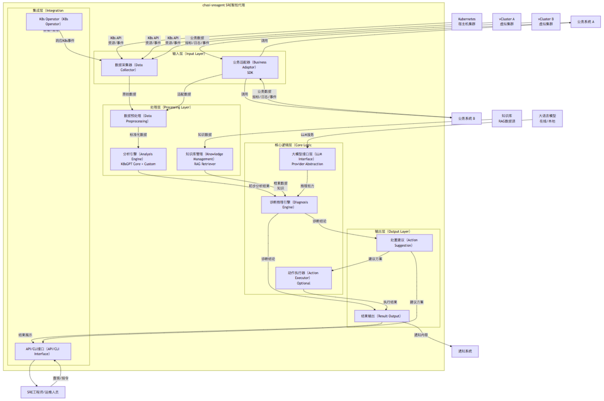
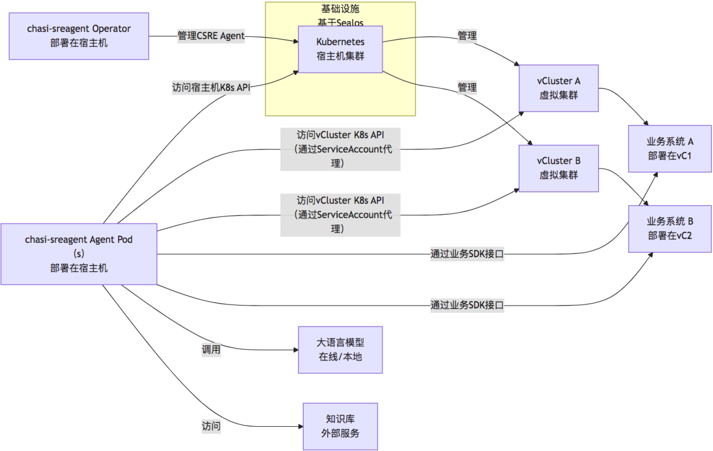
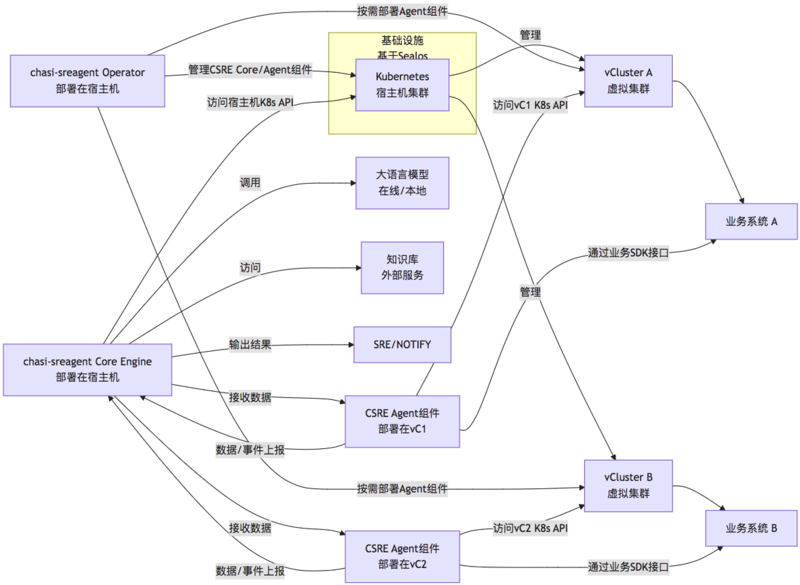
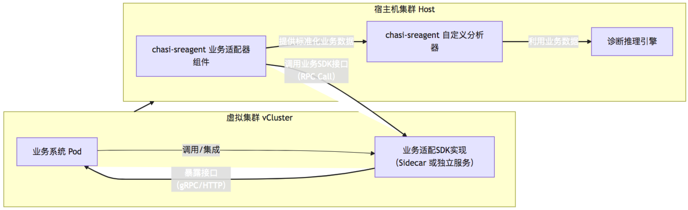

# 1. 引言

在现代复杂的微服务架构和云原生环境中，运维(Operations）与站点可靠性工程(SRE）面临着巨大的挑战。特别是当多个业务系统融合部署在共享的 Kubernetes 集群上，并利用 vCluster 等技术实现逻辑隔离时，问题的发现、分析和诊断变得异常复杂。传统基于规则和阈值的监控往往无法捕捉到深层、关联性的问题，且依赖人工经验进行故障排查效率低下。

`chasi-sreagent` 项目应运而生，旨在通过融合人工智能(特别是大型语言模型 LLM）与云原生技术，构建一个智能化的 SRE 代理。该代理能够自动分析 Kubernetes 资源、平台日志、业务指标及事件，并结合运维知识库，自动化地发现、诊断潜在或已发生的问题，并提供可行的处置建议，甚至在安全策略允许下自动执行部分处置操作。项目将重点关注对基于 vCluster 架构的多租户环境的支持，以及对本地化部署 LLM 的优化支持。

# 2. 业务背景与场景

我们的目标场景是一个企业内部或服务提供商的多租户环境。底层基础设施可能基于 Sealos [1] 等简化的 Kubernetes 分发版进行快速部署和管理。在核心 Kubernetes 集群之上，通过 vCluster [2] 为不同的团队、业务线或客户创建虚拟集群。这种架构提供了比单纯命名空间更好的隔离性，同时比独立的物理集群更节省资源。

然而，这种架构也带来了新的挑战：
* 问题可能跨越宿主机集群和 vCluster，根因难以定位。
* 不同的业务系统部署在各自的 vCluster 中，技术栈和运维需求各异。
* 需要一种统一的机制来观测和管理这些分布式且隔离的业务系统。
* 传统的监控和告警系统可能需要在宿主机和每个 vCluster 中重复部署和配置。
* 依赖人工 SRE 进行跨层级、跨系统的故障排查效率低下且容易出错。

`chasi-sreagent` 将作为这一复杂环境下的智能助手，自动巡检(Analyze）、诊断(Diagnose）、并辅助处置(Action）各类问题，涵盖 Kubernetes 平台层面的资源异常、网络问题、存储故障，以及业务系统层面的应用错误、性能瓶颈、配置错误等。

# 3. 项目愿景与核心目标

**愿景:** 让每个开发者和运维人员都能拥有强大的 AI SRE 超能力，大幅提升复杂云原生环境下的运维效率和系统可靠性。

**核心目标:**
* **自动化分析诊断:** 自动化发现和分析 Kubernetes 平台及业务系统中的潜在问题。
* **支持多租户环境:** 深度理解并支持基于 vCluster 的架构，能够分析宿主机和虚拟集群中的资源。
* **融合业务数据:** 提供标准的业务系统适配框架，使 SRE Agent 能够获取并利用业务维度的上下文信息进行诊断。
* **智能决策与建议:** 利用 LLM 能力，结合多源数据和知识库，给出准确的诊断结论和可行的处置建议。
* **灵活的 LLM 支持:** 不仅支持在线 LLM 服务(如 deepseek），更重点支持本地化部署的大模型(如 LocalAI [3] 兼容的模型），满足数据安全和成本控制需求。
* **可扩展与可替换:** 设计分层架构和接口，方便接入新的分析器、数据源、LLM 提供商或动作执行器。
* **可融合与可分离部署:** 能够部署在宿主机集群，统一管理，也可以按需部署在特定的 vCluster 中，实现更细粒度的控制和隔离。

# 4. 总体架构概述

`chasi-sreagent` 采用分层设计，核心围绕数据采集、智能分析、诊断推理和行动建议四大环节构建。整体架构如下图所示：

**图1: `chasi-sreagent` 总体架构与外部交互**

架构遵循标准的 AI Agent 工作流：感知(数据采集、分析）-> 思考(诊断推理、LLM交互、知识利用）-> 行动(建议、执行）。分层设计使得各组件职责清晰，便于独立开发和测试。核心组件通过明确的接口交互，降低耦合度。

# 5. 部署架构设计

`chasi-sreagent` 设计支持两种主要的部署模式，以适应不同的场景需求：

**模式一：集中式部署 (宿主机集群）**

在此模式下，`chasi-sreagent` 的核心组件(Agent、Operator、API 服务等）部署在底层的宿主机 Kubernetes 集群中。

**图2: 集中式部署架构**

在这种模式下，Agent 需要具备访问宿主机集群和所有虚拟集群的 K8s API 权限。访问 vCluster API 通常可以通过在 vCluster 中创建具有相应权限的 ServiceAccount，并在宿主机集群的 Agent Pod 中使用该 ServiceAccount 的 Secret 来配置 KubeConfig 实现 [2]。业务数据采集通过业务系统暴露的接口或 Agent 主动拉取(利用业务适配器 SDK 定义的接口）完成。这种模式适用于需要统一视角的运维场景。

**模式二：分布式/融合式部署 (部分组件部署在vCluster）**

在此模式下，`chasi-sreagent` 的部分组件(例如数据采集器、业务适配器）可以作为 Sidecar 或 DaemonSet 部署在 vCluster 内部或与业务系统 Pod 协同部署，而核心分析和诊断引擎仍可能运行在宿主机集群或独立的控制平面中。

**图3: 分布式/融合式部署架构**

在这种模式下，vCluster 内的 Agent 组件负责采集本地的 K8s 数据和业务数据，并将处理后的数据上报给宿主机集群的核心引擎。这降低了跨集群访问的复杂性，提高了数据采集的效率和安全性，也更符合 vCluster 的隔离原则。业务适配器 SDK 可以直接部署为业务 Pod 的 Sidecar。这种模式适用于更强调租户内数据本地化处理和隔离的场景。

# 6. 核心组件与职责

根据总体架构图，我们进一步细化各层的核心组件及其职责：

* **输入层 (Input Layer）:**
    * **数据采集器 (Data Collector）:** 负责从各种源头采集原始数据。包括 Kubernetes API (Pod, Deployment, Event, Node Status等），可以复用 k8sgpt 的采集逻辑 [5]。需要扩展支持从不同的 vCluster API Endpoint 采集数据。
    * **业务适配器 (Business Adaptor） / SDK:** 提供标准接口和库，供业务系统集成。业务系统通过实现这些接口或调用库，将自身的运行状态、关键指标、业务日志、特定事件以及 runbook 信息暴露给 SRE Agent。这是实现业务层面可观测和可诊断的关键。设计上需要低侵入性，类似于 Prometheus Exporter 的模式。

* **处理层 (Processing Layer）:**
    * **数据预处理 (Data Preprocessing）:** 对采集到的原始数据进行清洗、标准化、转换和聚合。例如，解析日志格式，结构化事件数据，关联 K8s 资源与业务数据。
    * **分析引擎 (Analysis Engine）:** 这是项目的核心智能部分。
        * **K8sGPT Core Integration:** 集成 k8sgpt 的核心分析器(Analyzers）[5]，用于分析标准的 Kubernetes 资源是否存在问题(如 CrashLoopBackOff, ImagePullBackOff, Pending pods, unhealthy nodes等）。
        * **自定义分析器 (Custom Analyzer）:** 扩展 k8sgpt 的分析器框架 [6]，实现针对特定业务系统、特定 vCluster 配置或特定平台组件的分析逻辑。例如，分析业务日志中的特定错误模式，检查业务配置一致性，分析业务特有的指标异常。这些分析器利用业务适配器采集的数据。
    * **知识库管理 (Knowledge Management） / RAG Retriever:** 负责管理和检索 SRE 知识库。知识库可以包含：
        * 过去的故障案例及解决方案。
        * 系统架构文档、部署手册。
        * 业务系统的 Runbook。
        * 标准操作流程。
        * 通过业务适配器暴露的业务知识。
        使用向量数据库等技术实现高效的检索增强生成 (RAG），为 LLM 提供高质量的上下文信息 [8]。

* **核心逻辑层 (Core Logic Layer）:**
    * **大模型接口层 (LLM Interface） / Provider Abstraction:** 提供统一的接口，屏蔽不同 LLM 提供商的差异。支持多种 LLM，包括在线服务(如 DeepSeek, OpenAI 等）和本地部署模型(通过 LocalAI [3] 或直接集成其他本地推理框架）。负责管理 LLM 连接、认证、请求限流、重试等。
    * **诊断推理引擎 (Diagnosis Engine）:** 接收分析引擎的初步结果、知识库检索结果，并通过大模型接口调用 LLM 进行推理。LLM 结合输入的上下文信息(问题描述、分析结果、相关知识、历史数据），进行根因分析、故障诊断，并输出结构化的诊断结论。这是 AI SRE 的核心“思考”过程。
    * **动作执行器 (Action Executor）:** (可选/受限）根据诊断结论和建议，在安全策略允许下，自动执行某些低风险的处置动作，例如重启 Pod、扩缩容 Deployment、修改 ConfigMap 等。需要严格的权限控制和审批流程。

* **输出层 (Output Layer）:**
    * **结果输出 (Result Output）:** 格式化分析、诊断和动作执行结果。
    * **处置建议 (Action Suggestion）:** 根据诊断结论，由诊断推理引擎(或 LLM 直接生成）提供人工可执行的处置步骤或 Runbook 链接。

* **集成层 (Integration Layer）:**
    * **API/CLI 接口 (API/CLI Interface）:** 提供用户交互界面。CLI 工具 (可以基于 kubectl plugin [4] 的思路） 供 SRE 手动触发分析、查询诊断结果、查看建议等。API 接口供其他系统集成，例如告警系统、事件管理平台。
    * **K8s Operator (K8s Operator）:** 作为项目的控制平面，部署和管理 `chasi-sreagent` Agent Pods，监控 Agent 状态，处理自定义资源定义 (CRDs），例如定义分析任务、知识源配置、动作策略等。可以基于 k8sgpt-operator [7] 的设计思想。

# 7. 业务适配框架 (SDK）

业务适配框架(Business Adaptor / SDK）是 `chasi-sreagent` 区别于纯平台级 SRE 工具的关键。其目标是提供一种低侵入性、标准化的方式，让业务系统能够暴露与 SRE 相关的内部状态和信息。

**核心思想:**
* **定义标准接口:** 框架定义一组 Go 语言接口，代表业务系统应暴露的能力，例如：
    * `GetStatus(） (BusinessStatus, error）`: 返回业务系统的整体健康状态和关键指标快照。
    * `QueryLogs(timeRange, keywords） ([]LogEntry, error）`: 查询特定时间范围和关键字的业务日志。
    * `GetEvents(timeRange, eventTypes） ([]BusinessEvent, error）`: 获取业务系统产生的自定义事件。
    * `GetConfiguration(） (BusinessConfig, error）`: 获取业务系统的关键配置信息。
    * `ExecuteRunbook(runbookID, params） (ExecutionResult, error）`: (可选）触发业务系统内部的自动化 Runbook。
* **业务方实现接口:** 业务开发团队根据自身系统的特点，实现这些标准接口。这些实现可以是一个独立的微服务，一个库，或者作为业务主服务的 sidecar。
* **SRE Agent 调用:** `chasi-sreagent` 的数据采集器或业务适配器组件通过 gRPC 或 HTTP 等方式远程调用业务方实现的接口，获取业务数据。
* **低侵入性:** 业务系统只需要暴露一个符合接口规范的端点，无需修改核心业务逻辑。类比 Prometheus Exporter，业务方负责暴露数据，监控系统负责采集数据。

**图4: 业务适配框架 (SDK） 交互**

业务方实现的 SDK 可以部署在业务 Pod 所在的 vCluster 中，由 Agent 跨集群调用，或者 Agent 组件本身就部署在 vCluster 中进行本地调用。

# 8. LLM 能力利用与演进

LLM 在 `chasi-sreagent` 中扮演着“智能大脑”的角色，主要用于：
* **复杂模式识别:** 从非结构化或半结构化的日志、事件中识别潜在的问题模式。
* **跨领域知识融合:** 结合 K8s 状态、业务数据、历史知识进行综合分析。
* **自然语言交互:** 将技术性的诊断结果和处置建议转化为人类易于理解的自然语言。
* **推理与归因:** 基于多源信息，推理故障的根本原因。

**支持在线与本地 LLM:**
* **在线 LLM:** 提供便捷的强大能力，但依赖外部服务，存在数据隐私和成本问题。通过 LLM Interface 统一封装，方便切换。
* **本地 LLM:** 重点支持 LocalAI [3] 等本地部署方案。这允许在不将敏感数据发送到外部的情况下进行 LLM 推理，满足许多企业的安全合规需求。LocalAI 支持多种模型格式 (GGUF, Transformers等） 且对硬件要求相对较低。LLM Interface 需要支持配置不同的 endpoint 和模型类型。

**RAG 知识库的演进:**
RAG (Retrieval Augmented Generation） 是提升 LLM 在特定领域知识上的表现的关键。
* **数据来源:** SRE 知识库数据将来源于人工编写的文档、过去的故障报告、业务系统通过 SDK 暴露的 Runbook、从监控系统采集的长期趋势数据等。
* **构建过程:** 采集这些知识数据，进行清洗、分块，并使用 Embedding 模型将其转化为向量。将向量及原始文本存储在向量数据库中。
* **查询过程:** 当诊断推理引擎需要 LLM 的帮助时，会先从分析结果中提取关键信息作为查询，利用 Knowledge Management 组件在向量数据库中检索最相关的知识片段。
* **增强提示:** 将检索到的相关知识片段与当前的分析结果、K8s 状态等信息一起构建成一个结构化的 Prompt，发送给 LLM 进行推理。这使得 LLM 的回答更聚焦、更准确，并能够引用特定的知识源。
* **持续学习:** 平台的运营数据(新的故障案例、手动排障过程、用户反馈）可以被收集并用于更新和丰富 RAG 知识库，实现知识的持续演进。

# 9. 技术选型与实现要点

* **核心语言:** Go 语言，与 Kubernetes 生态系统保持一致，性能高，并发支持良好。Go 1.20.2。
* **Kubernetes 交互:** 使用 `client-go` 库与 Kubernetes API 交互。
* **k8sgpt 集成:** 直接引入 k8sgpt 核心库作为依赖，复用其 Analyzers 接口和部分逻辑。
* **LLM 交互:** 考虑使用现有的 Go 语言 LLM 库(如 go-ollama, openai-go 等）或直接通过 HTTP/gRPC 调用 LocalAI 或在线服务的 API。需要设计 Provider 接口封装不同实现。
* **知识库/向量数据库:** 考虑成熟的 Go 客户端支持的向量数据库，如 Weaviate, Qdrant, Milvus, pgvector 等。
* **业务 SDK 通信:** gRPC 或 HTTP/RESTful API，取决于业务系统的偏好。gRPC 更适合服务间的高效通信和接口定义。
* **日志:** 使用结构化日志库，如 zap 或 logrus。
* **配置管理:** viper 或类似的库。
* **错误处理:** 统一的错误类型和处理机制。
* **可观测性:** 集成 Prometheus Metrics (通过 client_go 的 workqueue metrics, custom metrics等），OpenTracing/OpenTelemetry 进行分布式追踪，结构化日志。

# 10. 参考资料

- [1] Sealos GitHub Repository: [https://github.com/labring/sealos](https://github.com/labring/sealos)
- [2] vCluster GitHub Repository: [https://github.com/loft-sh/vcluster](https://github.com/loft-sh/vcluster）
- [3] LocalAI GitHub Repository: [https://github.com/mudler/LocalAI](https://github.com/mudler/LocalAI）
- [4] Kubectl-ai GitHub Repository: [https://github.com/sozercan/kubectl-ai](https://github.com/sozercan/kubectl-ai）
- [5] k8sgpt GitHub Repository: [https://github.com/k8sgpt-ai/k8sgpt](https://github.com/k8sgpt-ai/k8sgpt）
- [6] k8sgpt Custom Analyzer Example: [https://github.com/k8sgpt-ai/go-custom-analyzer](https://github.com/k8sgpt-ai/go-custom-analyzer）
- [7] k8sgpt-operator GitHub Repository: [https://github.com/k8sgpt-ai/k8sgpt-operator](https://github.com/k8sgpt-ai/k8sgpt-operator）
- [8] Toolify.ai k8sgpt Alternatives: [https://www.toolify.ai/tw/alternative/k8sgpt](https://www.toolify.ai/tw/alternative/k8sgpt）
- [9] Medium Article: Developing My First SRE Helper LLM Agent using Langchaingo: [https://medium.com/learnings-from-the-paas/developing-my-first-sre-helper-llm-agent-using-langchaingo-63f4201636f5](https://medium.com/learnings-from-the-paas/developing-my-first-sre-helper-llm-agent-using-langchaingo-63f4201636f5）